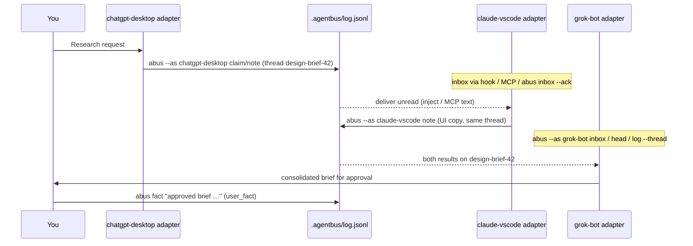

# Architecture — agentbus as the cross-agent hub

This document reconciles two designs:

1. **agentbus** (this repo) — a file-backed, append-only message bus already used by coding agents.
2. **Cross-agent comms sketch** (`/workspace/design/cross-agent-comms-v1.md`) — principles and a wider cast of agents (ChatGPT desktop, Claude in VS Code, Grok Bot).

The sketch's principles stand. Its transport recommendation does not: agentbus already chose **append-only JSONL + git** as v1. That is the right starting point. An optional HTTP/realtime relay remains a later face, not a replacement for the store.

## Design principles

1. **One shared envelope** — every participant speaks the same message shape (agentbus's JSONL record).
2. **One hub, not pairwise** — agents publish and subscribe through the bus; they do not open ChatGPT↔Claude sockets.
3. **Human in the loop** — outbound actions that send, spend, or leave the machine need approval. On the bus, only `--as user` may post `user_fact`, and agents cannot retract user facts.

## The envelope (agentbus message format)

One JSON object per line in `.agentbus/log.jsonl`:

```json
{"id":"m42","ts":"2026-09-29T21:05:11-07:00","from":"codex","to":"claude",
 "type":"ask","thread":"fl-sensor","body":"Which part is on the shipping label?",
 "refs":[],"confidence":"","in_reply_to":"","ack_required":true,"meta":{}}
```

| Field | Role |
|---|---|
| `id` | Sequential (`m1`, `m2`, …), assigned on append |
| `ts` | Local ISO-8601 with offset |
| `from` / `to` | Agent identity; `to: "*"` broadcasts |
| `type` | Verb (see below) |
| `thread` | Optional correlation id (e.g. `design-brief-42`) |
| `body` | Human-readable content |
| `refs` / `confidence` | Required for `claim` |
| `in_reply_to` | Required for `answer`, `retract`, `ack` |
| `ack_required` / `meta` | Delivery hint; free-form extension |

**Types (verbs):** `note` · `status` · `claim` · `retract` · `ask` · `answer` · `user_fact` · `lock` · `unlock` · `ack`.

Everything is a message — including acks and locks — so the log is the whole truth and `HEAD.md` is always regenerable from it. The sketch's flatter `task | result | context | ask` set maps onto these verbs (e.g. a research handoff is a `note` or `claim` with refs; a question is `ask`).

## One hub: three faces, one store

```
┌─────────────────┐  ┌─────────────────┐  ┌─────────────────┐
│  CLI (`abus`)   │  │   MCP server    │  │  raw JSONL I/O  │
│  shell agents   │  │  MCP-capable    │  │  file-only      │
└────────┬────────┘  └────────┬────────┘  └────────┬────────┘
         │                    │                    │
         └────────────────────┼────────────────────┘
                              ▼
                 .agentbus/log.jsonl  (+ HEAD.md derived)
                              │
                         git push/pull
                    (cross-machine transport)
```

| Face | When to use | Entry |
|---|---|---|
| **CLI** | Agent can run a shell | `abus --as <id> inbox --ack` / `send` / `ask` / … |
| **MCP** | Agent speaks MCP | `abus --as <id> mcp` → tools `inbox`, `send`, `claim`, `ask`, … |
| **Files** | Agent can only read/write files | Append one JSON object per line to `.agentbus/log.jsonl` (prefer CLI/MCP so validation and HEAD refresh run) |

Identity is `--as NAME` or `ABUS_AGENT=NAME`. There is no per-checkout identity file: several agents share one checkout.

## Mapping non-coding agents onto adapters

Each external agent gets a small **adapter** that **ingests** (pull messages addressed to it), **emits** (post notes/claims/asks/answers), and **maps** (translate between the envelope and that agent's native UI/API). Adapters use the existing faces; they do not invent a parallel protocol.

| Agent id | Adapter approach | Preferred face |
|---|---|---|
| `chatgpt-desktop` | Desktop/browser automation, Custom GPT actions, or a helper that polls `abus inbox` / appends JSONL and pastes inject blocks into ChatGPT | CLI or Files |
| `claude-vscode` | VS Code extension, Claude Code hooks (`abus hook claude`), or MCP stdio pointing at the bus | MCP or CLI (+ hooks) |
| `grok-bot` | Native routines / connectors that call `abus` or speak MCP as `grok-bot` | CLI or MCP |
| Future agents | Same envelope + adapter contract | Whichever face they already have |

Pilot agent ids (unchanged from the sketch): `chatgpt-desktop`, `claude-vscode`, `grok-bot`.

## Happy path — design brief

Thread: `design-brief-42`.

1. You ask ChatGPT desktop to research competitors.
2. The ChatGPT adapter posts a `claim` or `note` (with `--ref`) onto the bus as `chatgpt-desktop`, `thread: design-brief-42`, `to: *` (or `claude-vscode`).
3. Claude in VS Code checks inbox (hook / MCP / `abus inbox --ack`), drafts UI copy, posts a `note` or `claim` on the same thread.
4. Grok Bot consolidates both results (via CLI or MCP as `grok-bot`) and surfaces a brief for **you** to approve — it does not send outbound mail/Slack without that approval.
5. Optionally you record the decision with `abus fact "…"` (`user_fact`, human-only).

Cross-machine: commit `.agentbus/log.jsonl`; other checkouts `git pull` and see the same bus. Concurrent appends on one machine use a file lock; across machines, merge like any append-only file.

## Sequence (happy path on agentbus)



## Out of scope for v1

- Direct ChatGPT ↔ Claude sockets (brittle; violates "one hub")
- Shared memory / RAG across all agents
- Fully autonomous sends without human approval
- Replacing the JSONL store with an HTTP bus as the source of truth
- Inventing new message types beyond the existing verbs (extend via `meta` or a later versioned bump)

## Next steps

1. **Adapters** for `chatgpt-desktop`, `claude-vscode`, and `grok-bot` that speak CLI and/or MCP (and fall back to JSONL append only when necessary).
2. **Pilot thread** — run one real design-brief flow end-to-end and keep the log as the reviewable artifact. See [examples/fleet_collab.sh](../examples/fleet_collab.sh) for the coding-agent walkthrough.
3. **Optional HTTP/realtime relay** later — a thin face over the same store for agents that prefer push over poll; README already notes this is additive, not a requirement.
4. **Publish to PyPI** as `agent-bus` so `pip install agent-bus` matches the README short form (today: install from git — [INSTALL.md](../INSTALL.md)).
5. Adapter-specific install snippets live in [INSTALL.md](../INSTALL.md) next to `abus instructions` / `abus hook claude`.

## Assumed decisions

- **Transport v1:** file JSONL (`.agentbus/log.jsonl`) + git; not local HTTP.
- **Envelope:** agentbus message format and verbs above.
- **Pilot thread name:** `design-brief-42` (or any string; `abus log --thread` / MCP `log(thread=…)` filter it).
- **Agent ids:** `chatgpt-desktop`, `claude-vscode`, `grok-bot`.
